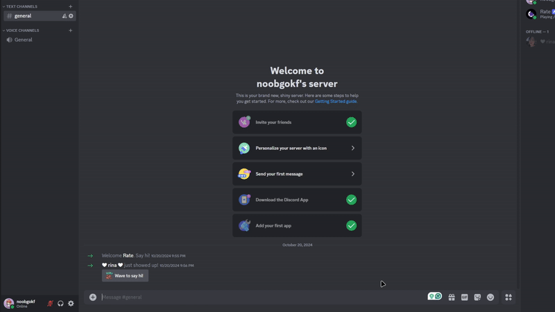
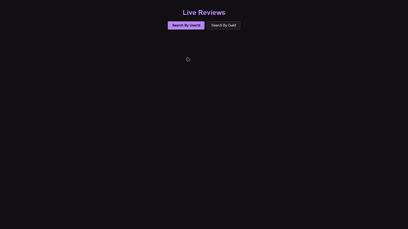

# Discord Review Bot 📋


[](https://www.python.org/)
[](LICENSE)
[](https://flask.palletsprojects.com/)
[](https://discordpy.readthedocs.io/)

The Discord Review Bot is a system that enables users to review each other within Discord servers, with data stored in a SQLite database. This bot allows for rating and reviewing other users, as well as displaying those reviews via a web interface powered by Flask.

---

## Features ✨

- **Review System**: Users can submit ratings and reviews for other users.
- **Web Interface**: View reviews via a live web interface powered by Flask.
- **Search by User or Guild**: Search for reviews based on user IDs or guild names.
- **Real-Time Updates**: New reviews are broadcast to the web interface in real-time via Socket.IO.
- **Bot Integration**: Manage reviews directly within Discord using slash commands.

## Demo



## Installation 🛠️

### Option 1: Running the bot and server locally

1. Clone this repository:
    ```bash
    git clone https://github.com/noobgokf1/Review-Discord-Bot
    ```

2. Install dependencies:
    ```bash
    pip install -r requirements.txt
    ```

3. Create a `.env` file and add your Discord bot token:
    ```
    DISCORD_BOT_TOKEN=your-discord-bot-token-here
    ```

4. Run the bot and Flask server:
    ```bash
    python run.py
    ```

## Usage 📖

### Discord Bot Commands

- `/setup`: Setup the server with review roles (1 ⭐ to 5 ⭐)
- `/review <user>`: Rate a user with a star rating (1-5) and leave a review.
- `/profile <user>`: View a user's reviews and average rating.
  
### Web Interface

1. **Search by User ID**:
   - Enter a Discord user ID to see the reviews written by or for that user.

2. **Search by Guild**:
   - Select a guild to view reviews submitted in that server.

The web interface is accessible at `http://localhost:5000/` (or the URL provided if deployed).

## Code Overview 🧩

This project includes:

- **Flask API**: Handles the HTTP requests to fetch and manage reviews.
  - Routes to view reviews by user or guild and add new reviews.
- **Discord Bot**: A bot built with `discord.py` that allows users to submit and view reviews directly in Discord.
- **Socket.IO**: For real-time communication between the bot and the web interface.
- **SQLite Database**: Stores user and review data locally.

### Key Functions

- `add_user_to_db()`: Adds users to the database.
- `add_review()`: Adds reviews to the database from the web interface or bot.
- `fetch_reviews()`: Retrieves reviews based on user ID or guild.
- `ReviewModal`: A Discord modal for submitting reviews.
  
## Folder Structure 📂
```plaintext
.
├── server.py       # Flask server for serving the web interface and handling reviews
├── main.py         # Discord bot code
├── run.py          # Runs both the Flask server and Discord bot in parallel
├── requirements.txt # List of dependencies
├── assets/          # Banner images and GIFs
├── templates/       # HTML templates for the web interface
├── .env             # Environment variables (for Discord bot token)
└── README.md        # This file

```
### Contributing 🤝
Contributions are welcome! If you'd like to improve or add features to the bot, feel free to submit an issue or a pull request.
## Issues and Features
- You can create issues to report bugs, suggest improvements, or request features.
- Fork the repository and submit a pull request to contribute.
### License 📝
This project is licensed under the MIT License - see the LICENSE file for details.

